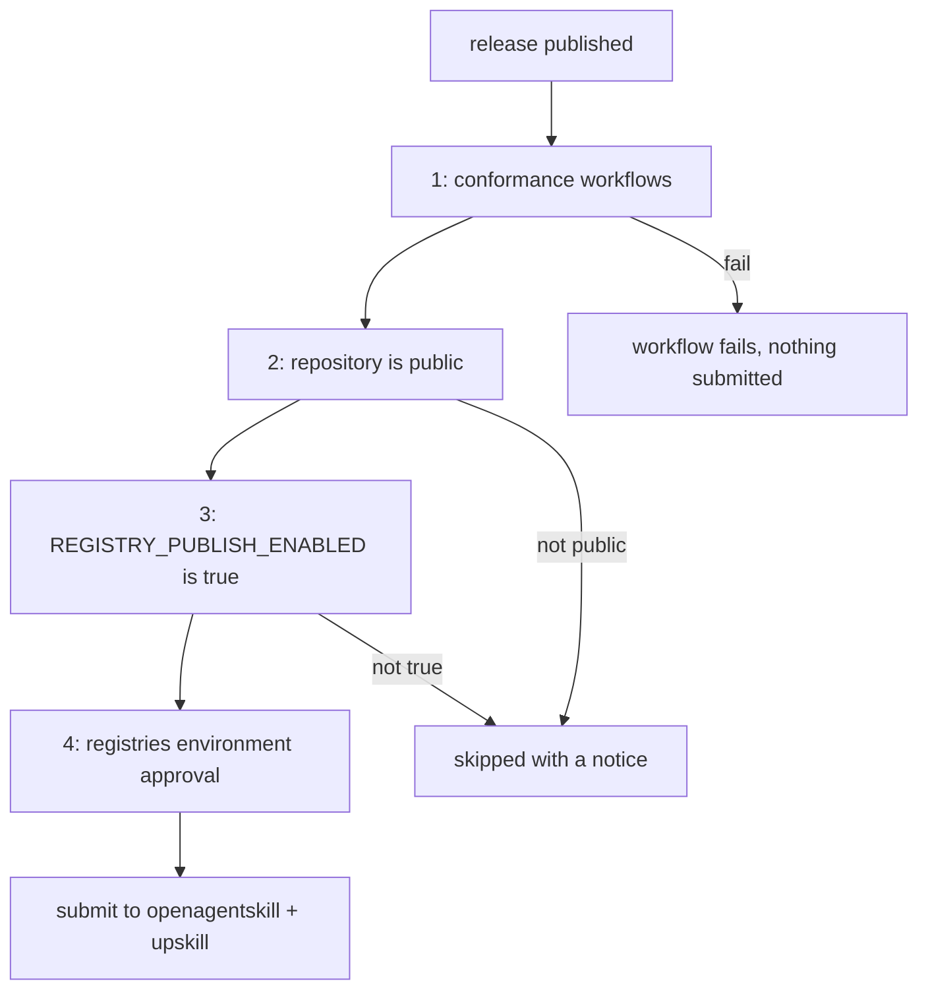

# Publishing to agent-skill registries

Registry submission is automated. [`.github/workflows/publish-registries.yml`](../.github/workflows/publish-registries.yml) is the **only** thing in this repository that contacts a registry, so the first listing and every later refresh run the same reviewed code. Nobody should submit by hand.

This document is for whoever cuts a release, or turns publishing on for the first time.

## How to publish

Cut a GitHub release. That is the whole procedure — then approve the environment prompt when GitHub asks.

To rehearse without submitting anything, run the workflow manually from the Actions tab with **Run workflow**. The `dry_run` input defaults to `true`, which renders the exact payloads into the job summary and contacts nothing.

## The four gates

Every gate must pass before a single request leaves the runner.



| Gate | Mechanism | Why |
|------|-----------|-----|
| 1. Conformance | `needs:` on [`spec-conformance.yml`](../.github/workflows/spec-conformance.yml) and [`skill-validator.yml`](../.github/workflows/skill-validator.yml) | Never publish a tree that fails the standard. The pull request run does not prove the tag is clean. |
| 2. Visibility | `gh api repos/... --jq .visibility` must be `public` | Every registry validates a public URL. Submitting a link that 404s wastes our one credible shot with that registry. |
| 3. Kill switch | Repository variable `REGISTRY_PUBLISH_ENABLED` must be exactly `true` | The deliberate hold, and the rollback. Setting it back to `false` stops all publishing without reverting code. |
| 4. Approval | The publish job runs in the `registries` environment | Neither registry documents a way to delete a submission, so a human confirms every one. **Permanent, not just for the initial rollout.** |

Gates 2 and 3 **skip with a notice** instead of failing, so a release cut while publishing is held does not produce a red build. Gate 1 fails hard.

## Turning publishing on for the first time

Prerequisites: the repository is public, and open-source sign-off is recorded on [AIE-13](https://aerospike.atlassian.net/browse/AIE-13).

1. Run the workflow manually with `dry_run: true` and confirm the rendered payloads look right. Do this after the repository is public — openagentskill's `/validate` endpoint reads `SKILL.md` over the public URL, so it is the first check that can only pass once we are public.
2. Create the `registries` environment (**Settings → Environments**) and add the [code owners](../.github/CODEOWNERS) as **required reviewers**. Without reviewers configured, gate 4 does nothing.
3. Set the repository variable (**Settings → Variables → Actions**): `REGISTRY_PUBLISH_ENABLED` = `true`.
4. Cut a release, or run the workflow with `dry_run: false`.
5. Approve the pending environment prompt.
6. Verify each listing URL resolves and record it in the table below.

## Registries

### openagentskill.com — primary

- **Listing:** https://www.openagentskill.com
- **Mechanism:** public `POST /api/skills/submit`. No account, free, and zero-star repositories are explicitly accepted.
- **Script:** [`scripts/publish-openagentskill.sh`](../scripts/publish-openagentskill.sh)

The script resolves the repository through `POST /api/skills/validate` first, then submits one payload per skill:

```json
{
  "repository": "https://github.com/aerospike/agent-skills",
  "skillPath": "skills/aerospike-development/SKILL.md",
  "submissionSource": "agent",
  "submittedByAgent": "aerospike-agent-skills-ci"
}
```

Two behaviors worth knowing:

- **Re-submission is expected and safe.** A duplicate response is treated as success, which is what makes a release-triggered refresh idempotent.
- **Listed and recommended are different states.** Only Reviewed, Verified, or Agent Proven skills enter default agent recommendations. Appearing in the directory does not mean agents will suggest us.

Each submission returns `{id, token, statusUrl}`. **The token is the only way to poll that submission later.** Tokens are private, so the workflow keeps them out of logs and the job summary, uploading them as the `registry-receipts` artifact (90-day retention). Transcribe them into the table below before the artifact expires.

### upskill (Autoloops) — secondary

- **Listing:** https://upskill.autoloops.ai/
- **Mechanism:** CLI publish with `@autoloops/upskill`, pinned in the workflow.
- **Script:** [`scripts/publish-upskill.sh`](../scripts/publish-upskill.sh)

The trap here is worth stating plainly: submissions are **disabled by default**, and `upskill submit` exits **successfully while doing nothing** when they are off. A naive workflow reports a green publish that never happened. The script therefore sets `submissions true` and then verifies the setting landed in `~/.config/upskill/config.json`, failing if it did not and warning loudly if the config file cannot be found.

Skills land in the `community` trust tier. Promotion to `reviewed` or `verified` is on upskill's roadmap and has no documented criteria or SLA, so do not promise a timeline.

Submitted URLs point at the **default branch**, not the release tag, so a listing keeps tracking updates rather than freezing at one release.

### skills.sh — best-effort, nothing to automate

- **Listing:** https://skills.sh (operated by Vercel)
- **Mechanism:** **none.** There is no form, no API, and no index repository to open a pull request against.

skills.sh indexes only what arrives through anonymous install telemetry from the `skills` CLI. Widely-circulated advice to open a pull request against `vercel-labs/skills` is wrong; the issue asking exactly that ([#880](https://github.com/vercel-labs/skills/issues/880)) is open and unanswered, and a pull request documenting that listing is telemetry-driven ([#1482](https://github.com/vercel-labs/skills/pull/1482)) is unmerged.

What we can do, and have done:

- Publish `npx skills add aerospike/agent-skills` in [`README.md`](../README.md) and [`compiled-skills/README.md`](../compiled-skills/README.md), because real installs are the only input to their index.
- Ship [`skills.sh.json`](../skills.sh.json) so the repository page groups our three skills sensibly once it appears. This is display-only and does not affect whether we are listed.

Note the known gap where install telemetry registers but the detail page still 404s ([#1610](https://github.com/vercel-labs/skills/issues/1610)). This is why skills.sh cannot be one of the committed listings for [AIE-13](https://aerospike.atlassian.net/browse/AIE-13).

### Not a registry: agentskills.io

`agentskills.io` hosts the **specification**, not a directory. Its [CONTRIBUTING.md](https://github.com/agentskills/agentskills/blob/main/CONTRIBUTING.md) says: "Skill submissions — We don't maintain a directory of community skills. This may change in the future." `/submit`, `/registry`, and `/skills` all 404. We conform to its spec (see below) but cannot list there.

## Adding another registry

1. Add a `scripts/publish-<registry>.sh` that supports `--dry-run` and appends JSON receipts, matching the two existing scripts.
2. Add a step to the `publish` job in [`publish-registries.yml`](../.github/workflows/publish-registries.yml), and a rendering line to the `dry-run` job.
3. Document the mechanism and any traps in this file.

Keeping submission logic in scripts rather than inline YAML is deliberate: a maintainer can dry-run it locally without pushing a branch.

## Spec conformance

Registries validate against the [Agent Skills specification](https://agentskills.io/specification), so conformance is a publishing prerequisite, not a formality.

```bash
./scripts/validate-spec.sh   # official skills-ref validator, spec conformance only
./scripts/validate-skill.sh  # third-party linter: links, token counts, layout
```

Both run in CI on every pull request that touches `skills/`. The spec allows only six frontmatter keys — `name`, `description`, `license`, `compatibility`, `metadata`, `allowed-tools` — and anything else, including our `last_verified`, belongs under `metadata`. See [CONTRIBUTING.md](../CONTRIBUTING.md#skill-frontmatter-skillmd).

`skills-ref` has no PyPI release and describes itself as a demonstration library, so it is installed from a pinned commit recorded in both [`scripts/validate-spec.sh`](../scripts/validate-spec.sh) and [`spec-conformance.yml`](../.github/workflows/spec-conformance.yml). Keep the two in sync.

## Live listings

Fill in as submissions land, and record the same links on [AIE-13](https://aerospike.atlassian.net/browse/AIE-13).

| Registry | Listing URL | Submission id | First submitted | Notes |
|----------|-------------|---------------|-----------------|-------|
| openagentskill | _pending_ | _pending_ | _pending_ | Tokens in the `registry-receipts` artifact |
| upskill | _pending_ | n/a | _pending_ | `community` trust tier |
| skills.sh | _pending_ | n/a | n/a | Telemetry-driven; no submission |
