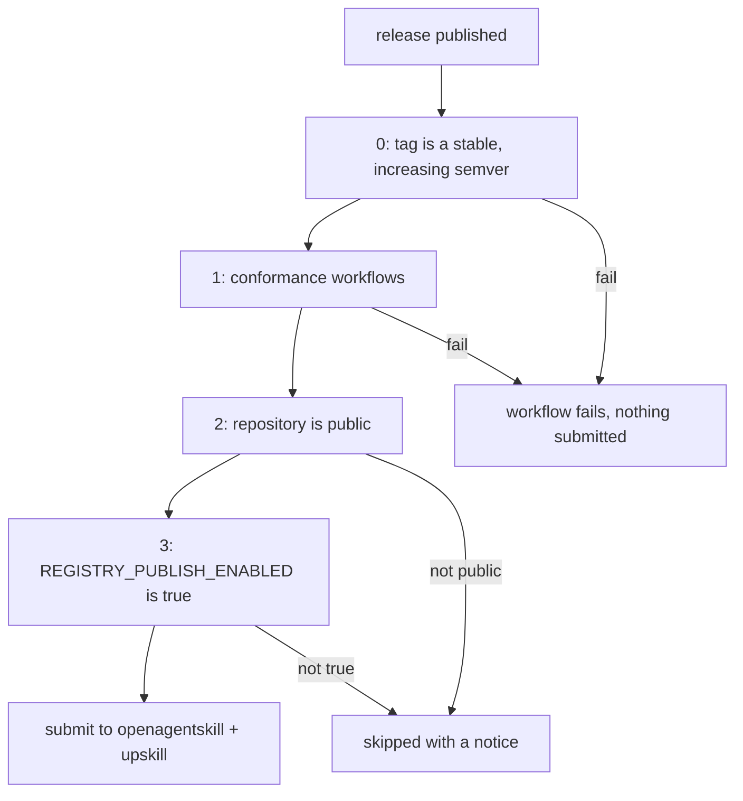

# Publishing to agent-skill registries

Registry submission is automated. [`.github/workflows/publish-registries.yml`](../.github/workflows/publish-registries.yml) is the **only** thing in this repository that contacts a registry, so the first listing and every later refresh run the same reviewed code. Nobody should submit by hand.

This document is for whoever cuts a release, or turns publishing on for the first time.

## How to publish

The published skill declares its own version, so a release is **two steps, in this order**: land the version bump, then tag it.

1. **Bump and recompile, in one commit.** `metadata.version` lives in [`scripts/skills_compile/published_skill.yaml`](../scripts/skills_compile/published_skill.yaml) and is compiled into the published frontmatter, so bumping it without recompiling leaves the artifact stale:

   ```bash
   # edit metadata.version, then:
   python3 scripts/compile-agents.py --shape stripped --write
   ```

   Record what changed in [`CHANGELOG.md`](../CHANGELOG.md) in the same commit, and merge it.

2. **Tag that commit and cut a GitHub release.** A release that clears the gates below submits on its own, with nothing to approve.

**Order matters.** Tagging first fails the release: `metadata.version` would still hold the previous number, and gate 0 compares the two. Skipping the recompile fails it too, at gate 1, because `compile-agents.py --check` sees the artifact lagging its source.

**A tag alone publishes nothing.** The workflow triggers on `release: published`, not on a tag push — so `git push origin v1.1.0` is safe to do ahead of time, and cutting the release is the act that submits.

See [Version numbers](#version-numbers) for what the tag has to look like.

To rehearse without submitting anything, run the workflow manually from the Actions tab with **Run workflow**. The `dry_run` input defaults to `true`, which renders the exact payloads into the job summary and contacts nothing.

## Version numbers

Releases are [semantic versions](https://semver.org/) with a `v` prefix, and [`release-version.yml`](../.github/workflows/release-version.yml) enforces four rules on every release before any gate below is reached:

| Rule | Rejected | Accepted |
|------|----------|----------|
| Exactly `vMAJOR.MINOR.PATCH`, no leading zeros | `1.4.0`, `v1.4`, `v1.04.0` | `v1.4.0` |
| No prerelease suffix, no build metadata, and not flagged **Set as a pre-release** on the release | `v1.4.0-rc.1`, `v1.4.0+build.3` | `v1.4.0` |
| Above the highest existing tag | `v1.3.9` after `v1.4.0` | `v1.4.1`, `v1.5.0`, `v2.0.0` |
| Equal to `metadata.version` in the published artifact | `v1.4.0` while the skill says `1.3.0` | `v1.4.0` while the skill says `1.4.0` |

The last rule exists because **a consumer who installed the skill reads its frontmatter, never our tag.** An artifact that misreports its own version is worse than an unversioned one, so a drifted release fails rather than shipping. What a major, minor or patch bump means for a package of prose is set out in [`CHANGELOG.md`](../CHANGELOG.md#what-a-version-means-here).

The version is hand-maintained rather than derived from `git describe`, because the published frontmatter is emitted verbatim to keep `compile-agents.py --check` byte-stable. Deriving it at compile time would make the artifact churn on every commit and turn drift detection into noise.

Stability is the rule worth understanding: publishing is **permanent**, because no registry documents a way to delete a submission. A release candidate that reaches a registry cannot be taken back, so a prerelease is not allowed to be a release here. Use a **draft** release to stage notes instead — drafts publish nothing until released.

Check a tag before you cut anything, rather than finding out from a red release build:

```bash
./scripts/check-release-version.sh --tag v1.4.0
```

The rules live in that script, not in the workflow, so the local check and the enforced check are the same code.

One gap to know about: a release creates its tag before the check runs, so the ordering rule compares against every *other* tag. Publishing a second release on a tag that already exists therefore reads as new — git cannot distinguish a tag the release just created from one that was already there. Nothing else re-uses a version number, so this is a caveat rather than a hole.

## The four gates

Every gate must pass before a single request leaves the runner.



| Gate | Mechanism | Why |
|------|-----------|-----|
| 0. Version | `needs:` on [`release-version.yml`](../.github/workflows/release-version.yml), which runs [`scripts/check-release-version.sh`](../scripts/check-release-version.sh) | A listing points at a version number people rely on. A malformed tag, a release candidate, or a version that goes backwards must not become a permanent submission. |
| 1. Conformance | `needs:` on [`spec-conformance.yml`](../.github/workflows/spec-conformance.yml), [`skill-validator.yml`](../.github/workflows/skill-validator.yml), and [`compile-agents.yml`](../.github/workflows/compile-agents.yml) | Never publish a tree that fails the standard, or an artifact that lags the sources it was compiled from. The pull request run does not prove the tag is clean. |
| 2. Visibility | `gh api repos/... --jq .visibility` must be `public` | Every registry validates a public URL. Submitting a link that 404s wastes our one credible shot with that registry. |
| 3. Kill switch | Repository variable `REGISTRY_PUBLISH_ENABLED` must be exactly `true` | The deliberate hold, and the rollback. Setting it back to `false` stops all publishing without reverting code. |

Gates 2 and 3 **skip with a notice** instead of failing, so a release cut while publishing is held does not produce a red build. Gates 0 and 1 fail hard — and they fail even while publishing is held, so a badly numbered release is reported the moment it is cut rather than at the first live publish.

There is no reviewer approval step. A release that clears these four gates submits unattended, which is the point: a correctly versioned release is the authorization, and re-submission is an idempotent refresh. The consequence to respect is that a **first** listing cannot be deleted by any documented means, so gate 3 is what holds publishing until that first submission is genuinely intended.

## Turning publishing on for the first time

Prerequisites: the repository is public, and open-source sign-off is recorded on [AIE-13](https://aerospike.atlassian.net/browse/AIE-13).

1. Run the workflow manually with `dry_run: true` and confirm the rendered payloads look right. Do this after the repository is public — openagentskill's `/validate` endpoint reads `SKILL.md` over the public URL, so it is the first check that can only pass once we are public.
2. Set the repository variable (**Settings → Variables → Actions**): `REGISTRY_PUBLISH_ENABLED` = `true`.
3. Cut a release tagged `vX.Y.Z`, or run the workflow with `dry_run: false`.
4. Verify each listing URL resolves and record it in the table below.

## Registries

### openagentskill.com — primary

- **Listing:** https://www.openagentskill.com
- **Mechanism:** public `POST /api/skills/submit`. No account, free, and zero-star repositories are explicitly accepted.
- **Script:** [`scripts/publish-openagentskill.sh`](../scripts/publish-openagentskill.sh)

The script resolves the repository through `POST /api/skills/validate` first, then submits one payload for the compiled skill:

```json
{
  "repository": "https://github.com/aerospike/agent-skills",
  "skillPath": "compiled-skills/aerospike/SKILL.md",
  "submissionSource": "agent",
  "submittedByAgent": "aerospike-agent-skills-ci"
}
```

Four behaviors worth knowing:

- **Use the `www` host.** The bare `openagentskill.com` answers every API request with a 307 to `www.openagentskill.com`. A `curl` without `-L` reads that as a failure, which is how the first live publish attempt died — reporting "the repository is not publicly readable yet" about a public repository. The script now targets the canonical host *and* follows redirects.
- **Frontmatter is parsed by line, not by a YAML parser.** With `description: >-`, `/validate` returned the literal string `">-"` as our description. The description is what drives trigger matching and what a human reads, so the published frontmatter keeps it on **one line** as a plain scalar — the only form a real YAML parser and a line-based parser agree on. That rules out `": "` anywhere in the text. A unit test enforces it; do not reformat it into a block scalar.
- **Re-submission is expected and safe.** A duplicate response is treated as success, which is what makes a release-triggered refresh idempotent.
- **Listed and recommended are different states.** Only Reviewed, Verified, or Agent Proven skills enter default agent recommendations. Appearing in the directory does not mean agents will suggest us.

`/validate` ignores any `ref` and always reads the default branch, so a fix cannot be rehearsed from a branch — it has to land on `main` before the registry will see it.

Each submission returns `{id, token, statusUrl}`. **The token is the only way to poll that submission later**, and `statusUrl` embeds the same value in its query string.

[`scripts/publish-openagentskill.sh`](../scripts/publish-openagentskill.sh) strips both before writing the receipt, so the `registry-receipts` artifact records the submission id and nothing that authenticates.

**What the token is.** openagentskill submission is anonymous and free — there is no Aerospike account behind it, so this is not an organisational credential, and losing or exposing one does not put a publishing identity at risk. Its only documented purpose is polling the status of the submission that returned it.

**Why it is redacted anyway.** The script used to archive the whole response, on the reasoning that an artifact is more private than a log. That reasoning does not hold on a public repository: workflow artifacts are downloadable by anyone who can read it. And while the documentation describes the token as read-only, it nowhere states that it *cannot* be used to modify a submission. Redacting costs nothing and retires the question, which is better than depending on an undocumented boundary.

Losing the token costs little in return. Submission is idempotent and each one returns its own fresh token, so **re-submitting is the supported way to get a pollable handle back** — which is also what a release already does. The id is what identifies the listing, and the id is what the receipt keeps.

### upskill (Autoloops) — secondary

- **Listing:** https://upskill.autoloops.ai/
- **Mechanism:** CLI publish with `@autoloops/upskill`, pinned in the workflow.
- **Script:** [`scripts/publish-upskill.sh`](../scripts/publish-upskill.sh)

The trap here is worth stating plainly: submissions are **disabled by default**, and `upskill submit` exits **successfully while doing nothing** when they are off. A naive workflow reports a green publish that never happened. The script therefore sets `submissions true` and then verifies the setting landed in `~/.config/upskill/config.json`, failing if it did not and warning loudly if the config file cannot be found.

The setting is named `submissions` on the command line but persists as **`submissionsEnabled`**:

```json
{ "telemetryEnabled": false, "submissionsEnabled": true, "contextEnabled": false }
```

Checking the command-line name found no key at all, read that as disabled, and aborted a correctly configured publish — the guard against a silent no-op became a hard failure on a working setup. The check now accepts either spelling and only refuses on an explicit `false`; a missing key warns instead, because an unrecognised schema is unknown, not off.

Skills land in the `community` trust tier. Promotion to `reviewed` or `verified` is on upskill's roadmap and has no documented criteria or SLA, so do not promise a timeline.

Submitted URLs point at the **default branch**, not the release tag, so a listing keeps tracking updates rather than freezing at one release.

### skills.sh — best-effort, nothing to automate

- **Listing:** https://skills.sh (operated by Vercel)
- **Mechanism:** **none.** There is no form, no API, and no index repository to open a pull request against.

skills.sh indexes only what arrives through anonymous install telemetry from the `skills` CLI. Widely-circulated advice to open a pull request against `vercel-labs/skills` is wrong; the issue asking exactly that ([#880](https://github.com/vercel-labs/skills/issues/880)) is open and unanswered, and a pull request documenting that listing is telemetry-driven ([#1482](https://github.com/vercel-labs/skills/pull/1482)) is unmerged.

What we can do, and have done:

- Publish `npx skills add https://github.com/aerospike/agent-skills/tree/main/compiled-skills/aerospike` in [`README.md`](../README.md) and [`compiled-skills/README.md`](../compiled-skills/README.md), because real installs are the only input to their index. The CLI discovers `skills/` first and would otherwise install the three authoring folders rather than the compiled skill.
- Ship [`skills.sh.json`](../skills.sh.json) so the repository page presents our published skill sensibly once it appears. This is display-only and does not affect whether we are listed.

Note the known gap where install telemetry registers but the detail page still 404s ([#1610](https://github.com/vercel-labs/skills/issues/1610)). This is why skills.sh cannot be one of the committed listings for [AIE-13](https://aerospike.atlassian.net/browse/AIE-13).

### Not a registry: agentskills.io

`agentskills.io` hosts the **specification**, not a directory. Its [CONTRIBUTING.md](https://github.com/agentskills/agentskills/blob/main/CONTRIBUTING.md) says: "Skill submissions — We don't maintain a directory of community skills. This may change in the future." `/submit`, `/registry`, and `/skills` all 404. We conform to its spec (see below) but cannot list there.

## Adding another registry

1. Add a `scripts/publish-<registry>.sh` that supports `--dry-run` and appends JSON receipts, matching the two existing scripts.
2. Add a step to the `publish` job in [`publish-registries.yml`](../.github/workflows/publish-registries.yml), and a rendering line to the `dry-run` job.
3. Document the mechanism and any traps in this file.

Keeping submission logic in scripts rather than inline YAML is deliberate: a maintainer can dry-run it locally without pushing a branch.

## Spec conformance

Registries validate against the [Agent Skills specification](https://agentskills.io/specification), so conformance is a publishing prerequisite, not a formality.

```bash
./scripts/validate-spec.sh   # official skills-ref validator, spec conformance only
./scripts/validate-skill.sh  # third-party linter: links, token counts, layout
```

Both run in CI on every pull request that touches `skills/`. Both also cover `compiled-skills/aerospike/`, the artifact registries actually fetch. The spec allows only six frontmatter keys — `name`, `description`, `license`, `compatibility`, `metadata`, `allowed-tools` — and anything else, including our `last_verified`, belongs under `metadata`. See [CONTRIBUTING.md](../CONTRIBUTING.md#skill-frontmatter-skillmd).

`skills-ref` has no PyPI release and describes itself as a demonstration library, so it is installed from a pinned commit recorded in both [`scripts/validate-spec.sh`](../scripts/validate-spec.sh) and [`spec-conformance.yml`](../.github/workflows/spec-conformance.yml). Keep the two in sync.

## Live listings

Fill in as submissions land, and record the same links on [AIE-13](https://aerospike.atlassian.net/browse/AIE-13).

**Never record a status token here, and do not go looking for one in the receipts.** This repository is public, including its workflow artifacts, and a token has no place in either. The submit script redacts both `token` and the `statusUrl` that embeds it, so a receipt carries the submission id alone — that is what belongs in this table. To poll a submission you no longer hold a token for, re-submit and use the fresh one it returns.

One row per registry, carrying the **most recent** submission. Earlier ones are in the history below.

| Registry | Listing URL | Latest submission id | Submitted | Notes |
|----------|-------------|----------------------|-----------|-------|
| openagentskill | https://www.openagentskill.com/skills/aerospike-agent-skills-aerospike | `e6b0ab8b-ae13-49f6-bf2e-877e084220be` | 2026-09-22 (v1.1.0) | Accepted, status `submitted`. Review is asynchronous — the listing served v1.0.0 content at the time of writing |
| upskill | _none_ | `eb288fce-e87c-4c92-8c00-e7c198092c88` | 2026-08-26 (v1.0.0) | **v1.1.0 was not submitted** — see below. The v1.0.0 submission was accepted, status `pending_review`, and never produced a public listing URL |
| skills.sh | _pending_ | n/a | n/a | Telemetry-driven; no submission |

### upskill did not receive v1.1.0

The v1.1.0 release ([run `35675460991`](https://github.com/aerospike/agent-skills/actions/runs/35675460991)) failed on the upskill leg with `error: fetch failed`. That is a transport failure, not a rejection: `mcp.autoloops.ai` resolves but does not answer, while `autoloops.ai` serves normally. Nothing in this repository needs changing.

Retry once their API answers again — the submission is idempotent, and re-running also re-submits to openagentskill harmlessly:

```bash
curl -s -o /dev/null -w "%{http_code}\n" --max-time 15 https://mcp.autoloops.ai/   # 000 means still down
gh run rerun 35675460991 --failed
```

The red run is the design working rather than a defect: `continue-on-error` kept upskill's failure from blocking openagentskill, and the final gate step still failed the job so a half-completed publish could not report green. Note that the two submit steps show `success` in the UI — `continue-on-error` masks `conclusion`, and the gate reads `outcome`.

### openagentskill pins to a commit, and does not re-fetch

Its submission records a `sourceUrl`, and v1.1.0's names a **commit SHA** where v1.0.0's named a branch:

```
v1.0.0   tree/main/compiled-skills/aerospike
v1.1.0   tree/166fbf03fd118ce3f864d3f1db41386a3055ec45/compiled-skills/aerospike
```

Between the two releases the listing never changed, still serving the pre-router `SKILL.md` from `7f9ce43` almost a month later. So the listing is a **pinned snapshot that only a release moves**, and the registry submits a single `skillPath` — meaning the `references/` and `examples/` files that [PR #45](https://github.com/aerospike/agent-skills/pull/45) added are very likely not served there at all. Whether that registry can carry a directory package is tracked with the AI ecosystem team rather than here.

### Earlier submissions

| Id | Release | Registry | Why it is not the row above |
|---|---|---|---|
| `baeeb4f7-98d2-47e4-84cc-76def25a6a48` | v1.0.0 | openagentskill | Superseded by the v1.1.0 submission |
| `308e1dd3-23be-4f68-800a-5d87561e4efc` | v1.0.0 | openagentskill | Created by run `33010412564`, which submitted to openagentskill and *then* failed on upskill — so it exists despite that run reporting as failed. All three resolve to the same slug |
